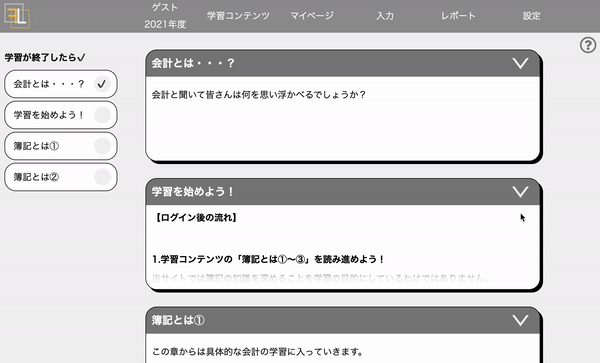
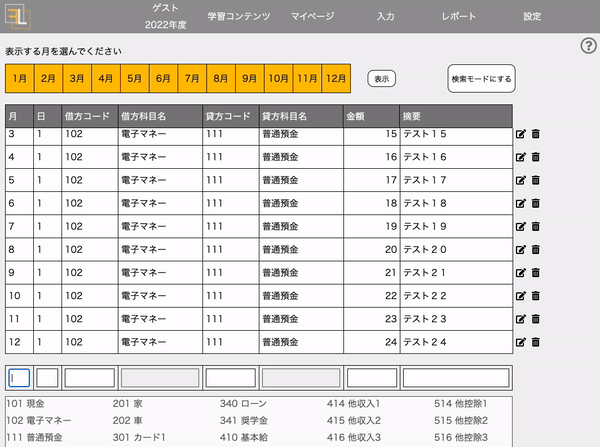
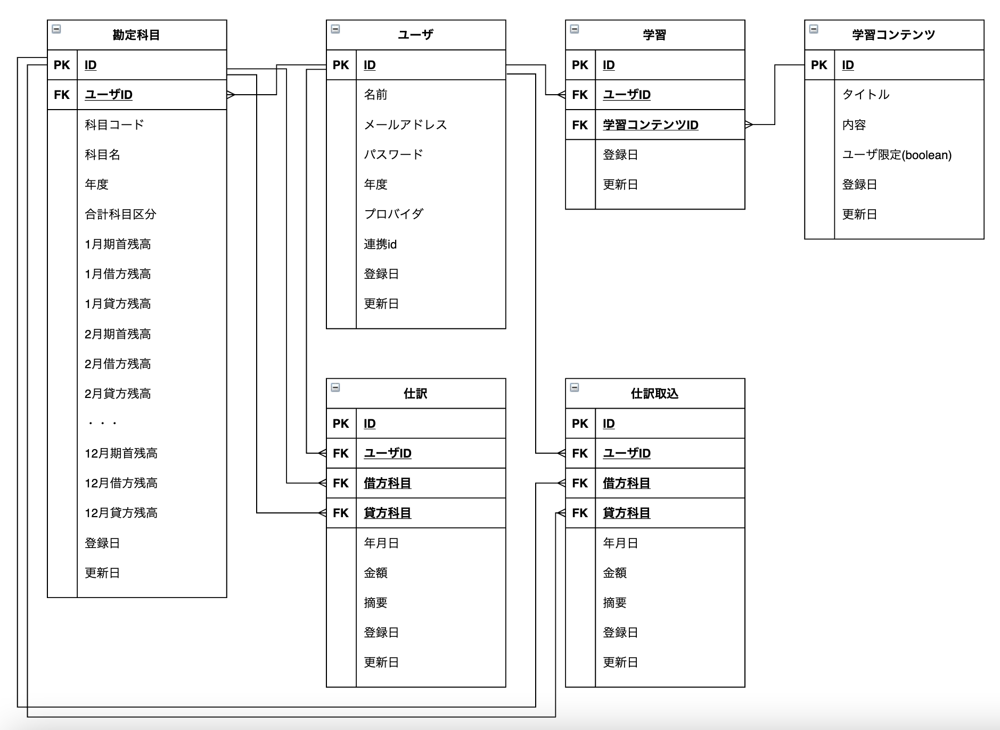

# ファイナンスラーニング

## サイト概要
日々の家計簿作成と分析を通して会計の知識を直感的に身につけるための学習サイトです。
学習コンテンツに簿記の基礎的な内容から上場企業の決算書の読み方を記載し、
日々の自身のお金の動きの分析から決算書を読むことができるようになることを目的とします。
サイトURLはこちらです。https://finance-learning.info/
（現在の学習コンテンツの内容はサンプルです。）

### 制作背景
どのようなビジネスを行うにしても、「会計力」を必要としない仕事はありません。
しかし、義務教育の中では、会計や税金について学ぶ機会は少なく、
これらの知識を持つことでビジネスに活かすことができるという認識を持つ方も少ないと感じます。
また、簿記の学習を資格取得のために行ったとしても用語の理解に留まり、「会計力」を身につけたとは言えないと考えています。
私は簿記学習後、4年間税理士事務所に勤務し会計コンサルティングを行ってきました。
この経験から得た私にとっての「会計力」を伝え、「会計力」の学習に役立ててもらうために、この学習サイトを開発しました。

### サイト構成
読んで学ぶ学習コンテンツ部と、実際に家計簿を入力して学ぶ会計ソフト部に分かれます。
一部画面イメージを載せておりますので、[サイトURL](https://finance-learning.info/)より実際に操作していただけると幸いです。
- #### 学習コンテンツ部
> - ページ遷移を少なくするために一覧画面にて全コンテンツを表示
> - ユーザビリティ向上のためにナビゲーションバーの固定やアンカーリンクを実装

- #### 会計ソフト部
> - 仕訳入力手段は、単一入力、簡易入力(現金orカード)、CSVインポートの3種類を用意
>   - 遷移後のレコード読込は15件に制限し、スクロールにて追加のレコードを取得
>   - 入力ミスを防止する仕組みとして下記2点を実装
>     - 摘要以外の入力項目は全角入力しても半角入力に変換
>     - 勘定科目コードを入力すると、科目候補を表示
>   - 入力のストレスを軽減する仕組みとして下記2点を実装
>     - 新規仕訳登録後、項目の先頭にfocusが移動
>     - 摘要以外の入力項目でEnterキー押下時、次の項目にfocus移動
> - 出力レポート形式は試算表、推移表、総勘定元帳の3種類を用意

画面イメージでは分かりづらいですが、入力は全て全角文字、フォーム移動操作はTabキーではなくEnterキーで行っています。

### ターゲットユーザ
ビジネスパーソン

### 主な利用シーン
- 社員教育
- 簿記の学習

### 技術的なポイント
- 基本的なCRUD処理の大部分を非同期で実装することで画面遷移を最小化
- 仕訳の作成・更新・削除と、勘定科目の残高更新はトランザクション化しデータの不整合を防止
- ActiveJob(アダプタとしてSidekiqを利用)を利用し大量データ作成時は非同期更新

## 設計書
- ER図

- インフラ構成図

- [機能一覧](https://docs.google.com/document/d/1_c5HmQF25Q6d3DatxCLNRaJy-4wkwoj4tmX-aX1MWzg/edit?usp=sharing)
- [画面遷移図](https://drive.google.com/file/d/1cpIB_k5r8FZJ6cOOY_hBE229Z8o5E3Q6/view?usp=sharing)
- [ワイヤーフレーム](https://drive.google.com/file/d/1hgPkVwPKku_hDD0TM4RtyETLd6Q3jNDX/view?usp=sharing)
- [テーブル定義書](https://docs.google.com/spreadsheets/d/1CPHR5xJOjhmdvQLVP6AWXKCxb5aLvb8SWyfue8_jlaA/edit?usp=sharing)
- [アプリケーション詳細設計](https://docs.google.com/spreadsheets/d/1yBjMO-ayAXDsC9zVAqm7BkgjLon4m1DfgGpdC1_WiSE/edit?usp=sharing)

## チャレンジ要素一覧
<https://docs.google.com/spreadsheets/d/1iD_-zJCk5ygOXnGm0qlLjmEY3U2gBJBzGJTeGrbtFL0/edit?usp=sharing>

## 静的コード解析ツール
- Rubocop

## テスティングフレームワーク
- RSpec

## 開発環境
- OS：Linux(CentOS)
- 言語：HTML,CSS,JavaScript,Ruby,SQL
- フレームワーク：Ruby on Rails
- JSライブラリ：jQuery
- IDE：Cloud9

## 本番環境
 - AWS (EC2, RDS)
 - Nginx, Puma, Redis, Sidekiq

## 使用素材
 - [linustock](https://www.linustock.com/)